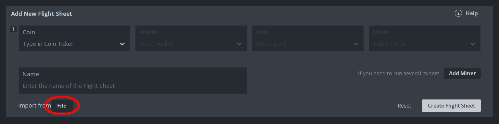
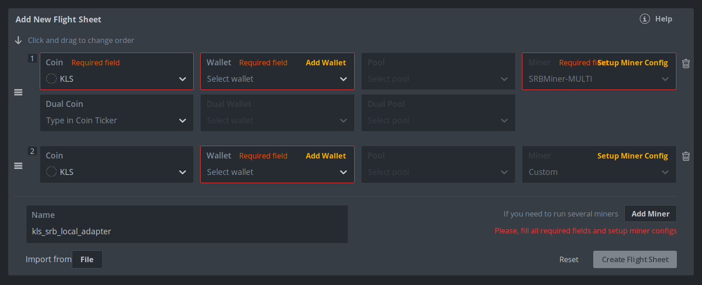
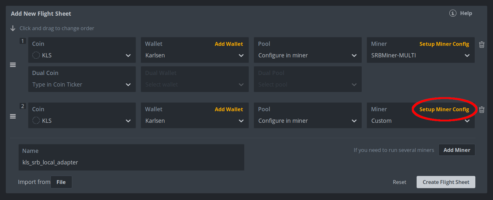
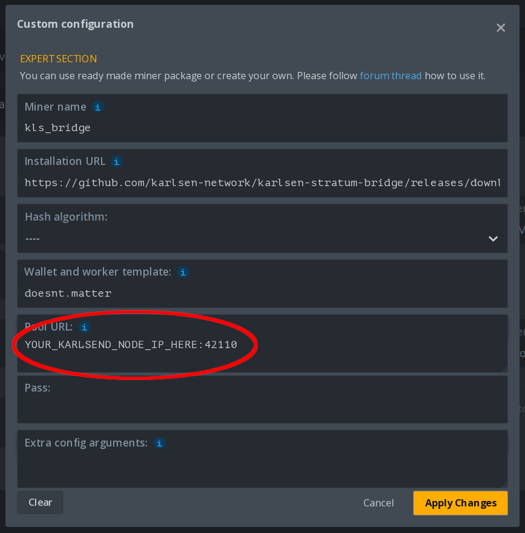
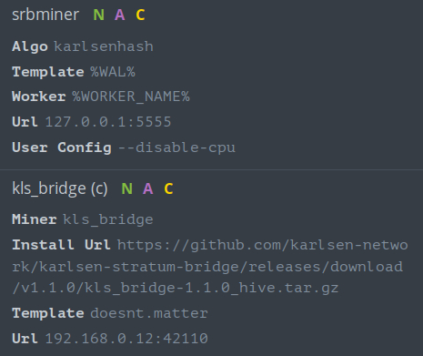
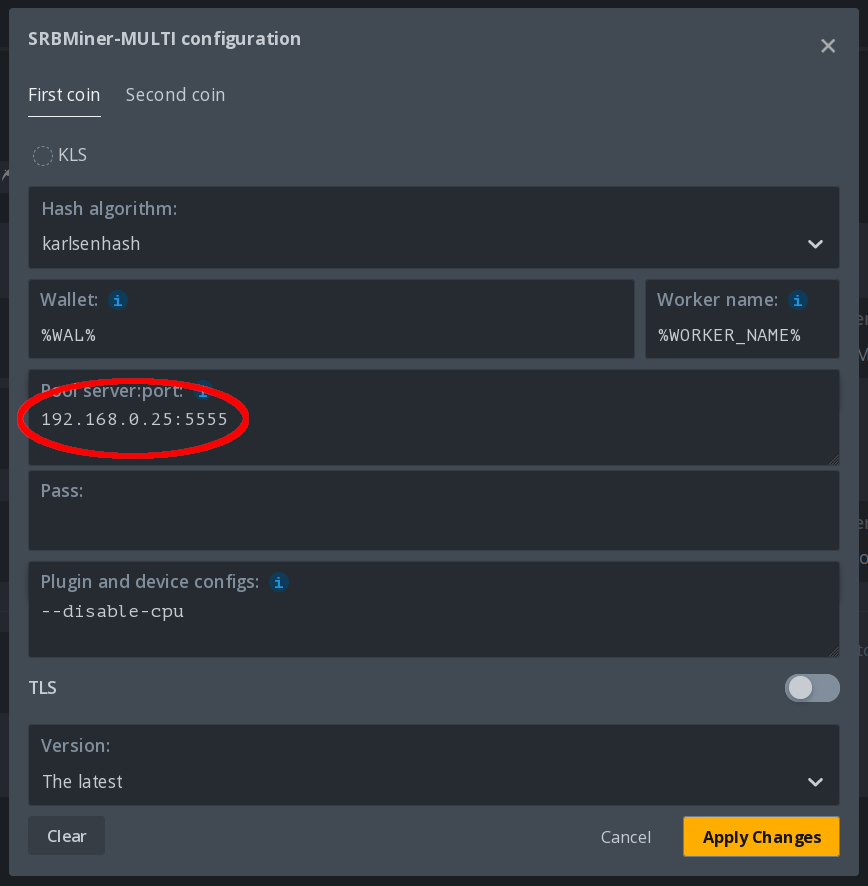

# Hive configuration

## Local bridge (1 birdge per miner)

This assumes that you will be running the `nexe_bridge` on the mining
computer and have configured already a Nexellia wallet in Hive. I've
provided one template flight sheet that can be imported to jumpstart
the config process.

I'll be using SRBminer here, so I'm focusing on the file [here](../misc/hive-templates/nexe_srb_local_adapter.json)
Hive gives the option to import from a file, so please navigate to the
template that you want and hit the 'Download raw file' button.

Now go to Hive, create a new flight sheet, and click the 'Import from
File' button.

Once the import happens you'll be presented with a flightsheet filled
with angry little red boxes like below.

Set the 'Coin' and 'Wallet' for both miners in the flight sheet, and
choose 'Configure in miner' for the 'Pool'. Strangly you cannot edit
the miner configs until you touch the pool config, so re-set it to
'Configure in miner' if the UI is being weird.

Last step, you just need to edit the custom miner section with the
address of the `nexelliad` node you're mining to. This needs the full
ip address and port so it'll look similar to `192.168.0.12:33455`
save the changes after you're finished.

You should be good to create the flight sheet now. However, you
should verify the configurations in both miners before you run it.
Never run something blindly off the internet. :) This is what the
configuration generally should look like.

The important parts are the 'Install URL' (make sure that points back
to this repo somewhere) and double check that your wallet address is
set correctly.

You can verify that the bridge is working by either feching miner logs,
or checking on the main miner -- if it's mining then the bridge is
working!

## Remote bridge (1 bridge for N miners)

This is the preferred configuration as it's a bit easier to setup and
the bridge can easily handle multiple miners.

Ideally you'd run the bridge on the same machine that your `nexelliad`
node is running on. You can follow any of the installation methods
defined in the main readme of the repo.

Once the bridge is running, miners can be configured simply by replacing
the pool URL with the ip:port of the bridge. In the example below the
bridge is running on `192.168.0.25:5555`

